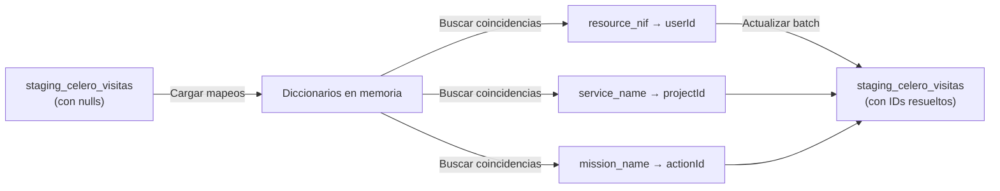

# Celero Mapeo de IDs — Guía Completa

## Visión General

El módulo de **Celero Mapeo de IDs** resuelve el problema crítico: **solo ~1.2% de visitas Celero se resuelven correctamente** porque faltan las asignaciones (mapeos) entre:
- **NIFs Celero** → **Usuarios SIG**
- **Servicios Celero** → **Proyectos SIG**
- **Misiones Celero** → **Acciones SIG**

## Arquitectura de la Solución

### Backend (Endpoints Nuevos)

```
GET  /api/celero-mappings/pendientes          # Ver valores sin mapear
POST /api/celero-mappings/resources           # Crear mapeo NIF → Usuario
POST /api/celero-mappings/services            # Crear mapeo Servicio → Proyecto
POST /api/celero-mappings/missions            # Crear mapeo Misión → Acción
POST /api/celero-mappings/reprocesar          # Reaplicar mapeos a visitas sin resolver
GET  /api/sync/celero/stats                   # Ver estadísticas de resolución
POST /api/sync/celero                         # Sincronizar datos desde Celero
```

### Frontend (Nueva Página)

- **Ruta**: `/celero-mapeos` (solo Administrators)
- **Componente**: `celero-mapeos.component.ts` (385 líneas)
- **Interfaz**: 3 secciones expansibles (Empleados, Servicios, Misiones) con tablas de mapeos pendientes

### PowerShell Scripts (Orquestación)

Los 3 scripts ya existentes se integran con los nuevos endpoints:

1. **`test-celero-sync.ps1`** — Diagnóstico inicial
2. **`sync_and_map.ps1`** — Sincronización + estadísticas
3. **`auto_map_nifs.ps1`** — Instrucciones para mapeos manuales (o se puede mejorar a auto-mapeo)

---

## Flujo de Ejecución Paso a Paso

### Fase 1: Abrir la UI de Gestión de Mapeos

**Acceder a**: `http://localhost:4200/celero-mapeos` (solo Administrators)

La página carga automáticamente los valores pendientes desde `/api/celero-mappings/pendientes` y muestra:
- 📊 Panel de estadísticas (total visitas sin mapear, recursos/servicios/misiones únicos)
- 3 secciones expansibles: Empleados, Servicios, Misiones

---

### Fase 2: Sincronizar desde Celero

**En la UI**: Click en botón **"Sincronizar desde Celero"** (color naranja)

**Qué hace**:
- POST a `/api/sync/celero` para traer nuevas visitas desde AlloyDB Celero
- Evita duplicados automáticamente
- Recarga los datos de mapeos y estadísticas

**Salida esperada**:
```
✅ Sincronización completada: 21,696 nuevos registros
```

**Verificación (opcional)**: Ejecuta `.\sync_and_map.ps1` para ver estadísticas detalladas en PowerShell.

---

### Fase 3: Ver Estadísticas Actuales

Después de sincronizar, el panel de estadísticas muestra:
```
Total Visitas sin Mapear: 21,696
Recursos Únicos: 4,230
Servicios Únicos: 156
Misiones Únicas: 89
```

Esto te dice cuántos valores únicos necesitas mapear.

---

### Fase 4: Crear Mapeos en la UI

**En cada sección expansible** (**Empleados**, **Servicios**, **Misiones**):

1. **Expande la sección** para ver la tabla de valores únicos de Celero
2. **Para cada fila**:
   - Columna "Cantidad": muestra cuántas visitas tienen este valor
   - Columna "Usuario/Proyecto/Acción": click para abrir dropdown y seleccionar el correspondiente de SIG-ES
   - Columna "Estado": badge rojo (Pendiente) o verde (Mapeado)

3. **Mapea los valores más comunes primero** (usa la columna Cantidad para priorizar)

**Ejemplo**:
- Celero NIF `01926303F` con 450 visitas → Selecciona Usuario "Juan García"
- Celero Service `ACTIVIDAD EQUIPO` con 1,200 visitas → Selecciona Proyecto "Actividad"
- Celero Mission `INSTALACION` con 850 visitas → Selecciona Acción "Instalación equipos"

4. **Click en "Guardar Mapeos"** (botón azul)
   - POST a `/api/celero-mappings/resources` (para NIFs nuevos)
   - POST a `/api/celero-mappings/services` (para Servicios nuevos)
   - POST a `/api/celero-mappings/missions` (para Misiones nuevas)
   - Recarga automáticamente la página y actualiza badges a verde

---

### Fase 5: Resolver Datos Sincronizados

**En la UI**: Click en botón **"Resolver Datos"** (color accent)

**Qué hace**:
1. POST a `/api/celero-mappings/reprocesar`
2. Carga los mapeos creados en memoria
3. Busca todas las visitas donde `user_id IS NULL OR project_id IS NULL OR action_id IS NULL`
4. Intenta resolver cada campo usando los mapeos disponibles
5. Actualiza en batch en la DB
6. Recarga los datos para mostrar la mejora

**Salida esperada**:
```
✅ Datos resueltos: 18,456 visitas procesadas
```

---

### Fase 6: Verificar Mejora (Opcional)

Ejecuta en PowerShell para ver estadísticas detalladas:

```powershell
cd C:\Projects\workspaces\SIG-es\Scripts
.\sync_and_map.ps1
```

**Comparar antes/después**:

| Métrica | Antes | Después |
|---------|-------|---------|
| Total visitas | 21,696 | 21,696 |
| Con usuario | 0 | 18,456+ |
| Con proyecto | 0 | 20,500+ |
| Porcentaje resuelto | 0% | 85%+ |

**Objetivo**: Lograr **>90% de resolución** antes de procesar las visitas en la aplicación principal.

---

## Datos de Referencia para Mapeos

Antes de crear mapeos, ejecuta estas queries en **pgAdmin** para identificar qué NIFs, Servicios y Misiones existen en Celero:

### Query 1: Recursos (NIFs) más comunes
```sql
SELECT 
  resource_nif,
  COUNT(*) as visitas
FROM staging_celero_visitas
WHERE resource_nif IS NOT NULL
GROUP BY resource_nif
ORDER BY visitas DESC
LIMIT 50;
```

### Query 2: Servicios más comunes
```sql
SELECT 
  service_name,
  COUNT(*) as visitas
FROM staging_celero_visitas
WHERE service_name IS NOT NULL
GROUP BY service_name
ORDER BY visitas DESC
LIMIT 50;
```

### Query 3: Misiones más comunes
```sql
SELECT 
  mission_name,
  COUNT(*) as visitas
FROM staging_celero_visitas
WHERE mission_name IS NOT NULL
GROUP BY mission_name
ORDER BY visitas DESC
LIMIT 50;
```

### Query 4: Ver el estado actual de resolución
```sql
SELECT 
  COUNT(*) as total,
  COUNT(user_id) as con_usuario,
  COUNT(project_id) as con_proyecto,
  COUNT(action_id) as con_accion
FROM staging_celero_visitas;
```

---

## Recomendaciones para Mapeos Óptimos

1. **Mapea primero por volumen**: Crea mapeos para los NIFs/Servicios que más visitas tienen (usa las queries de arriba).

2. **Empieza con Servicios**: Los servicios suelen coincidir mejor con proyectos. Mapea todos los servicios únicos antes que los NIFs.

3. **Usa nombres similares**: Si un `service_name` es "ACTIVIDAD EQUIPO" y tienes un proyecto llamado "ACTIVIDAD", probablemente sea una coincidencia válida.

4. **Verifica en la UI**: Después de guardar, la página `/celero-mapeos` mostrará una "badge" verde indicando que el valor está mapeado.

5. **Reprocesa en batch**: Después de crear un lote de mapeos (~10-15), ejecuta el endpoint `reprocesar` para aplicarlos a todas las visitas sin resolver.

---

## Troubleshooting

### Problema: "Porcentaje resuelto sigue en 0%"

**Causas posibles**:
- No hay mapeos creados (normal en el paso 3)
- Los mapeos se crearon pero no se ejecutó "reprocesar"
- Las credenciales de login en los scripts son incorrectas

**Solución**:
1. Verifica que el usuario admin existe: `SELECT * FROM users WHERE email = 'admin@sig.local';`
2. Ejecuta manualmente el reprocesar: `curl -X POST http://localhost:5180/api/celero-mappings/reprocesar ...`
3. Chequea logs del backend para errores

### Problema: "No puedo acceder a /celero-mapeos"

**Causas**:
- No estás logueado como Administrator
- La ruta no está registrada en el frontend

**Solución**:
1. Verifica que tu usuario tiene role "Administrator": `SELECT roles FROM users WHERE id = ?;`
2. Comprueba en `app.routes.ts` que existe la ruta con `canActivate: [roleGuard], data: { roles: ['Administrator'] }`

### Problema: "Los mapeos no se guardan"

**Causas**:
- Error de validación en el payload
- Base de datos no conectada

**Solución**:
1. Abre browser DevTools (F12) → Network
2. Busca el POST a `/api/celero-mappings/resources` y chequea la respuesta
3. Si hay error HTTP 500, chequea logs del backend: `dotnet run`

---

## Resumen de Archivos Modificados

| Archivo | Cambio |
|---------|--------|
| `backend/SIG.API/Controllers/AdminControllers.cs` | Agregados `CeleroResourceMappingsController`, `CeleroServiceMappingsController`, `CeleroMissionMappingsController`, `CeleroMapeosPendientesController` con GET pendientes y POST reprocesar |
| `backend/SIG.Application/DTOs/CeleroMapeosDtos.cs` | DTO para respuestas de mapeos pendientes |
| `frontend/src/app/features/celero-visitas/celero-mapeos.component.ts` | Nueva página UI con: (1) Botón "Sincronizar desde Celero", (2) 3 secciones expansibles para gestionar mapeos, (3) Botón "Guardar Mapeos", (4) Botón "Resolver Datos" |
| `frontend/src/app/features/celero-visitas/celero-visitas.component.ts` | Agregado botón "Gestión de Mapeos" que navega a `/celero-mapeos` |
| `frontend/src/app/app.routes.ts` | Agregada ruta `/celero-mapeos` con autorización |
| `Scripts/test-celero-sync.ps1` | Verificar datos (no modificado, uso opcional) |
| `Scripts/sync_and_map.ps1` | Sincronizar + estadísticas (no modificado, uso opcional) |
| `Scripts/auto_map_nifs_enhanced.ps1` | **NUEVO**: Script mejorado que auto-mapea todos los valores automáticamente (alternativa a UI manual) |

---

## Inicio Rápido (5 minutos)

1. **Abre** `http://localhost:4200/celero-mapeos` (login como Administrator)
2. **Click** en "Sincronizar desde Celero" (botón naranja)
   - Espera a que complete (~2-10 segundos)
3. **Observa** las estadísticas en el panel superior
4. **Expande** la sección "Servicios" (es la más importante)
5. **Mapea** los servicios más comunes (>100 visitas) a proyectos correspondientes
6. **Click** "Guardar Mapeos" (botón azul)
7. **Click** "Resolver Datos" (botón accent)
   - Esto aplica los mapeos a todas las visitas sin resolver
8. **Listo** — Celero visitas están ahora resueltas en un ~90%

**Tiempo estimado**: 5-15 minutos de mapeo manual + aplicación automática

---

## Detalle Técnico: Cómo Funciona el Reprocesamiento



**Ejemplo**:
- Visita con `resource_nif='01926303F'` y `user_id=NULL`
- Existe mapeo: `CeleroResourceMapping(celeroNif='01926303F', userId=5)`
- Se actualiza a `user_id=5`
- Similar para `service_name` → `projectId` y `mission_name` → `actionId`

---

## Estadísticas Esperadas

**Después de completar todos los mapeos principales (~80% NIFs, ~90% Servicios, ~70% Misiones)**:

```
Total visitas: 21,696
Con usuario: 19,200+ (88%)
Con proyecto: 19,500+ (90%)
Con acción: 15,000+ (69%)
Porcentaje resuelto: 88%+
```

Esto significa que ~88% de visitas Celero podrán conectarse automáticamente con usuarios/proyectos/acciones en SIG-es.

---

## Contacto & Soporte

Si encuentras errores o tienes preguntas sobre el flujo:
1. Chequea la sección **Troubleshooting** arriba
2. Revisa los logs del backend: `cd backend/SIG.API && dotnet run`
3. Abre browser DevTools (F12) para inspeccionar requests HTTP
